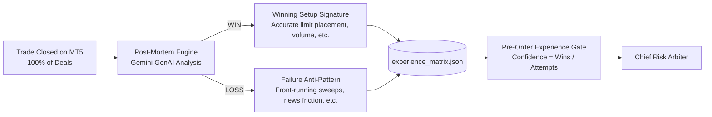

# AUTONOMOUS AGENTIC AI TRADING SYSTEM (XAUUSD / GOLD)
## Complete Master Architecture & Implementation Specification

**Project Name:** Autonomous Trading AI Platform  
**Repository:** `Mii116/Agentic-AI-For-Trading`  
**Current Build Version:** `v2.4.0-DualLimit-ContinuousLearning`  
**Primary Target Asset:** `XAUUSD` (Gold / US Dollar), secondary support for `BTCUSD`  
**Execution Environment:** MetaTrader 5 (MT5 Desktop Terminal 64-bit) & Local `PaperTradingEngine`  
**AI Reasoning Core:** Google Gemini GenAI SDK (`gemini-3.5-flash` / Gemini 3.8 Flash)  
**Quantitative & Enforcement Core:** 100% Deterministic Python (NumPy, Pandas, SQLAlchemy, FastAPI)  
**Document Generated:** October 6, 2026  

---

## 1. EXECUTIVE SUMMARY & SYSTEM OVERVIEW

The platform is an institutional-grade, fully autonomous algorithmic trading system designed specifically for Gold (**XAUUSD**). It fuses **Smart Money Concepts (SMC)**, **quantitative market microstructure analysis**, **macroeconomic yield filtering**, and **closed-loop continuous machine learning** with strict risk arbiter enforcement.

### Fundamental System Tenets
1. **Separation of Concerns (AI vs. Deterministic Code):**
   - **Google Gemini** acts as the *Reasoning & Reflection Layer* (higher-timeframe macro interpretation, trade thesis evaluation, and dual-sided post-mortem reflection on closed trades).
   - **Deterministic Python** acts as the *Authoritative Enforcement Layer*. All indicator math (EMAs, ATR, swing pivots), position sizing, margin checks, spread gating, order routing, and emergency stops are hardcoded and mathematically verified. Gemini is **never** permitted to execute trades, modify stops, calculate lot sizes, or alter risk budgets.
2. **Dual-Trader Multi-Mind Hierarchy:** Two decoupled trading personalities run concurrently on the same MT5 account equity pool, isolated strictly by MT5 `magic_number` (Swing: `1001`, Scalp: `2002`).
3. **High-Frequency Execution with Adverse-Selection Protection:** Combines 20-minute Time-To-Live (TTL) limit orders with active 5m Change-of-Character (CHoCH) cancellations, alongside a high-frequency `ZoneRetestMonitor` that requires tick displacement confirmation before entering.
4. **Proactive Protection & Structural Trailing:** A 3-second heartbeat `DangerSentry` with a 4-minute limit breathing buffer, 50% partial profit banking at 1:1 R:R, and ATR-buffered structural trailing behind confirmed 5-minute swing pivots (eliminating premature breakeven chokeouts).
5. **Continuous Experience Learning:** 100% of closed trades feed into Gemini to extract "Winning Setup Signatures" and "Failure Anti-Patterns" stored in a persistent `experience_matrix.json`. Historical win-rate confidence directly gates pre-trade order routing.

---

## 2. FULL PROJECT REPOSITORY DIRECTORY & FILE MANIFEST

The project codebase is organized into modular services and domain layers:

```
Ai Bot/
├── MASTER_BUILD_PROMPT.md                    # Core architecture requirements & institutional specification (1,246 lines)
├── SYSTEM_COMPLETE_MASTER_SPECIFICATION.md  # Comprehensive master system documentation (this file)
├── .gitignore                                # Git ignore rules
│
└── autonomous-trading-ai/
    ├── README.md                             # Quick-start documentation
    ├── CURRENT_BUILD.md                      # Build v2.4.0 specification notes
    ├── ENTRY_METHODS_GUIDE.md                # Quantitative entry methodologies & quant standards
    ├── Dockerfile                            # Docker container build specification
    ├── compose.yaml                          # Multi-container Docker Compose (PostgreSQL, Redis, FastAPI)
    ├── Makefile                              # Build and deployment targets
    ├── dashboard.bat                         # Windows one-click launcher for the live web dashboard
    ├── status.bat                            # Windows one-click launcher for terminal account status
    ├── .env.example                          # Environment variable configuration template
    │
    ├── frontend/                             # React + Vite scaffold
    │   ├── package.json                      # Frontend dependencies
    │   ├── vite.config.ts                    # Vite build configuration
    │   └── src/
    │       └── App.tsx                       # Initial React dashboard application component
    │
    └── backend/
        ├── pyproject.toml                    # Python project configuration
        ├── requirements.txt                  # Python dependencies
        ├── trading.db                        # Local SQLite database (TradeJournal, Orders, Positions)
        ├── trades_dump.json                  # Dump of all historical MT5 deal executions
        ├── analyze_trades.py                 # Ad-hoc trade inspection and M1/M5 bar diagnostic script
        ├── check_recent_trades.py            # Quick database trade inspector
        │
        ├── data/
        │   ├── experience_matrix.json        # Persistent setup clusters, confidence scores & signatures
        │   └── macro_state.json              # 30-minute cached US 10Y Yield and DXY state
        │
        ├── scripts/
        │   ├── run_bot.py                    # Main Dual-Trader Orchestrator runtime daemon
        │   ├── run_dashboard.py              # FastAPI Live Web Dashboard server (Port 8080)
        │   ├── status.py                     # Real-time console status of MT5 account & open positions
        │   ├── close_all.py                  # Emergency market close script for all open positions
        │   ├── dump_trades.py                # Deal history extractor from MT5 into trades_dump.json
        │   ├── generate_audit_md.py          # Markdown audit table generator from deal history
        │   ├── init_db.py                    # Database table initialisation script
        │   ├── test_agent.py                 # Unit test for AI Strategy Agent
        │   ├── test_mt5.py                   # MT5 terminal connection and symbol info test
        │   ├── test_multi_agent.py           # Multi-agent proposal generation test
        │   ├── test_paper_engine.py          # Paper trading simulation test
        │   ├── test_single_cycle.py          # Single end-to-end data/scout/execution test
        │   ├── test_trade.py                 # Order sending verification test
        │   └── test_xauusd.py                # Gold tick and multi-timeframe bar test
        │
        └── app/
            ├── main.py                       # FastAPI application entrypoint, routers & dashboard mount
            │
            ├── config/
            │   ├── __init__.py
            │   └── settings.py               # Pydantic BaseSettings (.env loading, MT5 credentials, risk limits)
            │
            ├── db/
            │   ├── __init__.py
            │   ├── session.py                # SQLAlchemy engine & SessionLocal factory
            │   └── init_db.py                # Base metadata create_all initializer
            │
            ├── models/
            │   ├── __init__.py
            │   ├── trading.py                # Order, Position, AccountBalance, TradeJournal ORM models
            │   ├── strategy.py               # TradingHypothesis and BacktestResult ORM models
            │   ├── market_data.py            # MarketBar OHLCV bar ORM model
            │   └── audit.py                  # AgentAuditLog ORM model
            │
            ├── schemas/
            │   ├── __init__.py
            │   ├── trade.py                  # Pydantic schemas for orders and trades
            │   ├── position.py               # Pydantic schemas for open positions
            │   ├── strategy.py               # Pydantic schemas for hypotheses
            │   ├── risk.py                   # Pydantic schemas for risk parameters
            │   └── macro.py                  # Pydantic schemas for macro regime
            │
            ├── agents/
            │   ├── __init__.py
            │   ├── trade_proposal.py         # Standardized TradeProposal data transfer object
            │   ├── arbiter.py                # ChiefRiskArbiter (The Gatekeeper & order executor)
            │   ├── swing_trader.py           # Swing Trader (Magic: 1001, H4/H1/30m flow, Yield filter)
            │   ├── scalp_trader.py           # Scalp Trader (Magic: 2002, 100% deterministic local M5/M1)
            │   ├── macro_director.py         # HTF H4/H1 EMA and market regime classifier
            │   ├── structural_scout.py       # M15 BOS / CHoCH structural scout
            │   ├── micro_sniper.py           # M5/M1 liquidity sweep and FVG sniper
            │   └── nfp_event.py              # Pre/post-release volatility handler for NFP releases
            │
            ├── agent/
            │   ├── __init__.py
            │   ├── core.py                   # Base StrategyAgent AI orchestration
            │   ├── experience_engine.py      # ExperienceEngine: clusters, confidence scores & matrix sync
            │   ├── post_mortem.py            # PostMortemEngine: Dual-sided AI analysis of wins and losses
            │   └── indicators.py             # Basic indicator helpers
            │
            ├── trading/
            │   ├── __init__.py
            │   ├── arbiter.py                # Alias re-exporting ChiefRiskArbiter
            │   ├── mt5_engine.py             # MT5ExecutionEngine: MT5 API, limits, TTL, CHoCH cancel, sync
            │   ├── paper_engine.py           # PaperTradingEngine: simulated paper broker execution
            │   ├── danger_sentry.py          # DangerSentry: 3s heartbeat, 4m buffer, M5 exhaustion, trailing
            │   ├── zone_monitor.py           # ZoneRetestMonitor: dynamic tick displacement confirmation
            │   ├── cooldown_manager.py       # MarketCooldownManager: $3 zone debounce & 15m scalper cooldown
            │   └── macro_worker.py           # AlphaVantageMacroWorker: 30m cached US 10Y Yield and DXY query
            │
            ├── risk/
            │   ├── __init__.py
            │   ├── capital_manager.py        # CapitalManager & AccountTier (lot sizing, circuit breakers)
            │   ├── market_filters.py         # MarketFilters (spread guard, economic calendar blackout)
            │   ├── stop_policy.py            # Volatility-adjusted stop policy (min $1.50, ATR-scaled)
            │   └── var_calculator.py         # Value-at-Risk calculations
            │
            ├── indicators/
            │   ├── __init__.py
            │   ├── smc.py                    # SMCAnalyzer: EMAs, swings, BOS/CHoCH, FVGs, session levels
            │   └── scalp_signals.py          # Vectorized NumPy signals (server offset, sweeps, fresh FVGs)
            │
            ├── execution/
            │   ├── __init__.py
            │   ├── base.py                   # BaseExecutionRouter abstract class
            │   ├── order_router.py           # OrderRouter: Central routing, volume slicing, limit execution
            │   └── smart_execution.py        # SmartExecutionHandler: execution checks & tranche calculation
            │
            ├── data/
            │   ├── __init__.py
            │   ├── mt5_data.py               # MT5DataClient: bar fetching, tick fetching, DB persistence
            │   └── alpha_vantage.py          # AlphaVantageClient: raw API connector for macro & commodities
            │
            ├── services/
            │   ├── __init__.py
            │   ├── market_data_service.py    # Market data business logic
            │   ├── trading_service.py        # Trading state business logic
            │   └── analytics_service.py      # Strategy and performance analytics
            │
            ├── portfolio/
            │   ├── __init__.py
            │   ├── manager.py                # Portfolio risk & allocation manager
            │   └── rebalancer.py             # Rebalancing engine
            │
            ├── monitoring/
            │   ├── __init__.py
            │   ├── health.py                 # System health and heartbeat checks
            │   └── alerts.py                 # Risk and error alert dispatching
            │
            ├── reports/
            │   ├── __init__.py
            │   ├── performance.py            # Quantitative performance calculations
            │   └── exporter.py               # PDF and CSV report exporter
            │
            ├── strategies/
            │   ├── __init__.py
            │   ├── base.py                   # BaseStrategy interface
            │   ├── registry.py               # Strategy registry
            │   ├── smc_swing.py              # SMC Swing strategy implementation
            │   └── session_scalp.py          # Session Scalp strategy implementation
            │
            ├── api/
            │   ├── dashboard.py              # Dashboard API endpoints (/api/dashboard/status, /history, etc.)
            │   └── trading_api.py            # Institutional Trading API endpoints (/api/v1/trade/close_all, etc.)
            │
            └── static/
                └── index.html                # Institutional Dark Web Dashboard & Live Workflow Monitor (971 lines)
```

---

## 3. DETAILED SUBSYSTEM ARCHITECTURES

### A. The Dual-Trader Hierarchy (Two Independent Minds)

The system segregates trading responsibilities into two decoupled strategy engines sharing the same MT5 account equity and margin pool:

```mermaid
graph TD
    subgraph Data Feeds
        MT5[MT5 Multi-Timeframe Feeds<br/>D1, H4, H1, M30, M15, M5, M1, Tick]
        Macro[Alpha Vantage Macro Worker<br/>US 10Y Yields & DXY Trend]
        Cal[Economic Calendar Gate<br/>ForexFactory High-Impact USD]
    end

    subgraph Dual Minds
        Swing[Swing Trader Magic 1001<br/>- D1/H4 Trend + H1 Zones + M30 BOS<br/>- US 10Y Yield Gating<br/>- Pyramiding Scale-In Engine<br/>- Risk: 1.5% - 2.0%]
        Scalp[Scalp Trader Magic 2002<br/>- 100% Deterministic Local Engine<br/>- M5/M1 Sweeps & Fresh FVGs<br/>- London/NY 07:00-17:00 UTC<br/>- Macro Exempt | Risk: 0.50%]
    end

    subgraph Institutional Gatekeeper
        Arbiter[Chief Risk Arbiter]
        Matrix[Experience Matrix Gate<br/>>= 60% Confidence or H1 Confirm]
        Margin[Shared Margin Guard <= 20%]
        Spread[Spread Guard <= 40-50 pts]
        Debounce[Price Zone Debounce $3.00 / 20m]
        Cooldown[Scalper 15m Exit Cooldown]
    end

    subgraph Execution & Monitoring
        ZoneMon[ZoneRetestMonitor<br/>Tick Displacement Confirmation]
        MT5Exec[MT5 Execution Engine<br/>20m TTL Limits & 5m CHoCH Cancel]
        Sentry[Danger Sentry 3s Heartbeat<br/>4m Limit Buffer | 1:1 Partial TP<br/>M5 Structural Trailing]
    end

    MT5 --> Swing
    MT5 --> Scalp
    Macro --> Swing
    Swing --> Arbiter
    Scalp --> Arbiter
    Cal --> Arbiter
    Matrix --> Arbiter
    Margin --> Arbiter
    Spread --> Arbiter
    Debounce --> Arbiter
    Cooldown --> Arbiter

    Arbiter --> ZoneMon
    Arbiter --> MT5Exec
    ZoneMon --> MT5Exec
    MT5Exec --> Sentry
```

#### 1. Swing Trader ("The Institutional Partner") — Magic: `1001`
- **Timeframe Stack:**
  - *Macro Bias:* Daily (D1) & 4-Hour (H4) directional flow using 200 EMA + 50 EMA trend slope.
  - *Context & Key Zones:* 1-Hour (H1) structural levels, liquidity pools, and Order Blocks.
  - *Confirmation & Execution:* 30-Minute (M30) & 15-Minute (M15) Break of Structure (BOS) / Change of Character (CHoCH).
- **Exogenous Macro Gate & Multi-Timeframe Decoupling (`AlphaVantageMacroWorker` & `MacroDirector`):**
  - Evaluates US 10-Year Treasury Yields (`TREASURY_YIELD`) and Dollar Trend (`FX_DAILY`).
  - **Rule:** Requires falling or stable yields before approving Swing Longs. If 10Y yields surge $\ge 0.05\%$ with a strengthening Dollar, Gold Buy setups are strictly vetoed.
  - **H1 Multi-Timeframe Decoupling (Anti-Lag Reform):** Multi-dollar intraday expansions (e.g. Gold rallying $30–$50 from $4,120 to $4,160) occur while higher-timeframe H4 EMAs (e.g. 50/200 EMA at $4,189–$4,199) remain technically lagging. The system decouples active swing pullbacks: if H1 structure is confirmed `BULLISH` or `LEAN_BULLISH` (price > H1 EMAs with BOS/CHoCH) and the Alpha Vantage 10Y Yield gate is cleared (`allow_gold_swing_buy: true`), swing long pullback limits are explicitly permitted (`allow_long: true`), preventing false-positive `REJECTED_MACRO_ALIGNMENT` lockouts.
- **Pyramiding / Scale-In Engine:**
  - Monitors running Swing positions.
  - When the primary trade reaches $\ge 1:1$ R:R with Stop Loss locked at Breakeven, and price retraces into a 5m/15m FVG or 50%–61.8% equilibrium zone with a confirmed reversal candle, it emits an automated secondary scale-in order at 50% of primary lot size.
- **Stop Loss & Target:** Structural invalidation anchored behind H1/30m swing levels ($4.00–$8.00 distance on Gold). Target: institutional 1:3.0 Risk-to-Reward.
- **Base Risk Budget:** 1.5% equity per trade.
- **Pre-Trade Self-Check:** Automatically queries the last 3 failed trades for Magic 1001 from SQLite and runs an AI evaluation against known anti-patterns before dispatching.

#### 2. Scalp Trader ("The Liquid Sniper") — Magic: `2002`
- **100% Deterministic Local Python Engine:** Zero network or LLM calls in the active execution path. Vectorized NumPy algorithms scan closed M5 bars in $< 1$ millisecond.
- **Timeframe Stack:** Operates exclusively on 5-Minute (M5) and 1-Minute (M1) charts.
- **True UTC Server Handling:** MT5 broker server timestamps are adjusted to True UTC by dynamically measuring the broker server offset from live ticks.
- **Session Filter (Volatility Window):** Active exclusively during the **London & New York overlap (07:00–17:00 UTC)**. Asian hours are blocked to prevent spread drag and chop.
- **Hedging Independence:** Completely exempt from the Swing Trader's bias. Scalp trades may trade pullbacks counter to an active Swing position without mutual liquidation.
- **Setups Detected:**
  1. `M5_SWEEP_RETEST`: Session sweeps of Previous Day High/Low (PDH/PDL), Asian (00:00–07:00 UTC) or London (07:00–12:00 UTC) extremes with rejection wicks $\ge 40\%$.
  2. `M5_FVG_RETEST`: Fresh (untested) institutional Fair Value Gaps formed by displacement bodies $\ge 0.8 \times \text{ATR}$ and gap sizes $\ge 0.25 \times \text{ATR}$.
- **Quantitative Loss Freeze:** 2 consecutive losses trigger a 30-minute execution freeze on Magic `2002`. Cumulative daily loss $\ge 2.0\%$ reduces risk budget to 0.15%.
- **Mandatory Cooldown:** Enforces a **15-minute mandatory cooldown** after any market exit.
- **Base Risk Budget:** 0.50% equity per trade.

---

### B. Execution Architecture: Limits, TTL & Zone Retest Monitor

The execution layer in `app/trading/mt5_engine.py`, `app/execution/order_router.py`, and `app/trading/zone_monitor.py` implements two advanced execution paradigms:

#### 1. High-Frequency Pending Limit Order Engine
- **Pricing:**
  - Bullish: `ORDER_TYPE_BUY_LIMIT` at the 50% equilibrium of an M1/M5 FVG or demand block.
  - Bearish: `ORDER_TYPE_SELL_LIMIT` at the 50% equilibrium of an M1/M5 FVG or supply block.
- **20-Minute Time-To-Live (TTL):** Orders are placed with `type_time = ORDER_TIME_SPECIFIED` expiring in 20 minutes (`now + 1200s`). If the broker rejects specified expiration, the order falls back to `ORDER_TIME_GTC` while a software watchdog cancels it at 20 minutes.
- **Active 5m CHoCH Invalidation (`manage_pending_limit_orders`):**
  - If a 5-Minute candle closes and forms a Change of Character (CHoCH) *before* the limit order is tagged:
    - *Pending Buy Limit:* Cancelled immediately if an M5 candle closes cleanly below the recent 5m swing low.
    - *Pending Sell Limit:* Cancelled immediately if an M5 candle closes cleanly above the recent 5m swing high.
  - Order is eliminated via `TRADE_ACTION_REMOVE` with **$0 capital lost**.

#### 2. Dynamic Zone Retest Monitor (`ZoneRetestMonitor`)
Solves the quant dilemma of **adverse selection** (passive limits missing runaway moves and catching falling knives):
1. **Arming:** Scalp setups *arm* a price zone `[zone_low, zone_high]` in memory without placing a resting order on the broker book.
2. **Knife Invalidation:** If incoming ticks breach the invalidation anchor, the zone is disarmed immediately with zero execution.
3. **Zone Mitigation:** Waits for live price to enter the defined zone.
4. **Displacement Confirmation Tick:** Once mitigated, requires a directional momentum tick (higher than prior 3 ticks for BUY, lower for SELL, plus $\ge \$0.15$ rebound from the touch extreme).
5. **Market Dispatch:** Fires a fast market order via MT5 with `deviation = 25` and volatility-adjusted Stop Loss.

---

### C. Chief Risk Arbiter Gatekeeper

The Arbiter (`app/agents/arbiter.py`) is the mathematical barrier that evaluates all candidate proposals before routing:

| Gate | Check | Threshold / Enforcement |
|:---|:---|:---|
| **Capital Tiers** | Account Equity | Tier 1 ($< \$250, 1.5\%$), Tier 2 ($\$250–\$500, 2.0\%$), Tier 3 ($> \$500, 2.0\%$) |
| **Circuit Breaker** | Daily Drawdown | Max $5\% - 10\%$ daily equity drawdown halts new entries for 24 hours |
| **Shared Margin Guard** | Cumulative Margin | Total utilized margin across Magic 1001 & 2002 capped at $\le 20.0\%$ of equity |
| **Spread Guard** | Real-Time Broker Spread | Blocks execution if Gold spread exceeds 40–50 points ($\$0.40–\$0.50$) |
| **News Blackout** | High-Impact USD Events | Freezes entries **30m before** and **15m after** CPI, NFP, FOMC, Fed Decisions |
| **Zone Debounce** | Repeated Stopout Protection | Blacklists re-entry in same direction within **$\$3.00$** of exit for **20 minutes** |
| **Gate 7B: Scalp Cooldown** | Post-Exit Recovery | Mandates a **15-minute freeze** on Scalp Trader (Magic 2002) after any trade close |
| **Gate 7C: Macro Alignment** | Multi-Timeframe Direction | Blends H4/H1 trend + Alpha Vantage 10Y Yields (`allow_gold_swing_buy`). H1 bullish structure or yield clearance unblocks swing pullback longs, eliminating lagging H4 200 EMA lockouts. (Scalper 2002 is macro exempt). |
| **Experience Gate** | Historical Win Rate | Requires $\ge 60\%$ confidence in `experience_matrix.json` or mandates H1 trend alignment |
| **Min Stop Distance** | Broker Spread Protection | Dynamic Stop: $\max(\text{structural}, 1.5 \times \text{ATR}, \$2.00)$ with hard floor at **$\$1.50$** |
| **Concurrency Ceiling** | Order & Position Ceiling | Maximum 3 active limit orders; maximum 2 simultaneous open positions |

---

### D. Proactive Danger Sentry & Dynamic Trailing Engine

Located in `app/trading/danger_sentry.py`, the Sentry runs on a dedicated **3-second background heartbeat**:

#### 1. Entry Buffers & Grace Periods
- **4-Minute Limit Breathing Buffer (240s):** Limit fills receive a 240-second buffer where micro-exhaustion wicks and intraday pullbacks are ignored, letting the position breathe.
- **180-Second Market Grace Period:** Market entries receive 180 seconds immunity from micro-structural noise.

#### 2. Muted 5-Minute Exhaustion Exits
- Intraday 1-minute counter-wicks are completely bypassed.
- Exhaustion exits evaluate **exclusively on confirmed 5-minute (M5) candle closes** and require at least **2 consecutive rejection candles with wicks $\ge 50\%$ and declining volume**.

#### 3. 50% Partial Take-Profit & Structural Trailing
- **1:1 R:R Partial Close:** When price reaches 1:1 Risk-to-Reward, the Sentry automatically closes **50% of the position volume** to bank 1R profit.
- **Structural Trailing (No Breakeven Choke):** Rather than clamping the stop to entry $+ \$0.20$ (which chokes normal retests), the stop is placed behind the most recent confirmed **M5 swing low (for Longs)** or **M5 swing high (for Shorts)** buffered by ATR.
- **Continuous Ratchet:** As price advances, the stop ratchets forward behind new M5 swing pivots, allowing trades to achieve multi-R statistical expansion while guaranteeing accumulated profits.

---

### E. Dual-Sided Continuous Learning & Experience Matrix

Located in `app/agent/experience_engine.py` and `app/agent/post_mortem.py`:



#### Setup Clusters in `experience_matrix.json`:
1. `M5_FVG_LIMIT`: Intraday limit entries at M5 Fair Value Gap equilibrium.
2. `M1_SWEEP_RETEST`: Session high/low liquidity sweep retest entries.
3. `H1_PULLBACK_LIMIT`: Higher-timeframe swing pullback and scale-in limits.
4. `SWING_M30_BOS_LIMIT`: Institutional swing trend continuation entries.

#### Confidence Gating Rules:
$$\text{Confidence Score} = \frac{\text{Successful Trades}}{\text{Total Attempts}}$$
- **Confidence $\ge 75\%$:** Approved immediately with standard dynamic sizing.
- **Confidence $< 60\%$:** Mandates higher-timeframe (H1) directional confirmation. If H1 is neutral or counter, rejected with `REJECTED_EXPERIENCE_GATE`.

---

## 4. DATABASE SCHEMAS & PERSISTENCE (`trading.db`)

The SQLite database (`trading.db`) is managed via SQLAlchemy ORM in `app/models/`:

### 1. `trade_journals` (Institutional Trade Journal)
- `id` (Integer, Primary Key)
- `ticket` (Integer, Indexed) — MT5 broker position ticket
- `symbol` (String, Default: "XAUUSD")
- `side` (String) — BUY or SELL
- `lot_size` (Float) — Executed volume
- `entry_price` (Float), `exit_price` (Float)
- `stop_loss` (Float), `take_profit` (Float)
- `realized_pnl` (Float) — Net closed profit/loss
- `status` (String) — `PASS`, `FAIL`, `BREAKEVEN`, `OPEN`
- `magic_number` (Integer) — `1001` (Swing) or `2002` (Scalp)
- `partial_closed` (Boolean), `is_scale_in` (Boolean)
- `technique_used` (String) — e.g., `M5 Fair Value Gap`, `H1 BOS`
- `reason` (Text) — Full entry thesis and supporting confluences
- `invalidation_condition` (Text) — Structural invalidation level
- `exit_reason` (String) — `TAKE_PROFIT`, `STOP_LOSS`, `EMERGENCY_DANGER_CLOSE`, etc.
- `danger_trigger` (String) — Sentry danger trigger notes
- `why_it_went_wrong` (Text) — AI post-mortem diagnosis
- `lessons_learned` (Text) — Extracted winning signature or failure anti-pattern
- `opened_at` (DateTime), `closed_at` (DateTime)

### 2. `orders` & `positions`
- `orders`: Records all dispatched orders (ticket, symbol, side, order_type, quantity, price, stop_loss, take_profit, status, mode).
- `positions`: Real-time tracked positions (ticket, symbol, side, quantity, entry_price, current_price, unrealized_pnl, stop_loss, take_profit, is_open, mode).

### 3. `account_balances`
- `mode` (String, Unique) — `MT5_LIVE`, `MT5_DEMO`, `PAPER`
- `cash_balance` (Float), `equity` (Float), `used_margin` (Float), `free_margin` (Float)

### 4. `trading_hypotheses` & `backtest_results`
- `trading_hypotheses`: Full audit trail of AI-generated hypotheses (thesis, confidence, supporting/counter evidence, status).
- `backtest_results`: Quantitative backtesting metrics (Sharpe, Sortino, max drawdown, win rate, profit factor).

---

## 5. USER INTERFACES & MONITORING TELEMETRY

### A. Live Web Dashboard & Command Center (`backend/app/static/index.html`)
The primary monitoring interface is a 971-line institutional dark-theme web dashboard served via FastAPI on port 8080:

- **Typography & Styling:** JetBrains Mono & Outfit typography, glassmorphism cards, CSS radial background gradients.
- **Header Controls:** Real-time pulse indicator, "Refresh Data" trigger, and red "Emergency Close All Positions" button.
- **Top Metrics Grid:**
  - Account Equity & Cash Balance
  - Gold Price (XAUUSD Bid/Ask) & Live Spread (in points)
  - Realized Win Rate & Total Trade Counts
  - Realized Net PnL & Active Positions Count
- **Tab 1: Live Agent Workflow & Decision Pipeline:**
  - Interactive multi-step visual pipeline (Step 1 Macro Director $\rightarrow$ Step 2 Structural Scout $\rightarrow$ Step 3 Micro Sniper $\rightarrow$ Step 4 Risk Arbiter $\rightarrow$ Step 5 Execution Engine).
  - Dual-mind status cards displaying Swing Trader (1001) and Scalp Trader (2002) state, active bias, and risk parameters.
  - Live AI Hypothesis Audit Feed.
- **Tab 2: Active Positions & Danger Sentry:**
  - Live table of open positions with magic number role breakdown.
  - Dynamic **Danger Meter** visualizing percentage distance to Stop Loss.
  - Grace Period countdown badges (e.g., "Limit Buffer Active: 180s remaining").
- **Tab 3: Institutional Trade Journal & AI Post-Mortem:**
  - Complete history of closed trades with colored badges (`PASS`, `FAIL`, `BREAKEVEN`).
  - Full expander displaying Gemini-generated **Why It Went Wrong** diagnoses and **Lessons Learned**.

### B. Command-Line Status & Operational Utilities
- `status.bat` / `backend/scripts/status.py`: Connects directly to MT5 terminal and prints instant account equity, balance, margin, and open position tickets with live PnL.
- `dashboard.bat` / `backend/scripts/run_dashboard.py`: Starts the Uvicorn web dashboard server on `http://localhost:8080`.
- `backend/scripts/close_all.py`: Instant CLI kill-switch that liquidates all open positions across both magic numbers.
- `backend/scripts/dump_trades.py`: Exports MT5 deal history into `trades_dump.json`.
- `backend/scripts/generate_audit_md.py`: Formats deal history into a publication-ready Markdown audit table.

---

## 6. RUNTIME DAEMONS, SCHEDULES & OPERATION RUNBOOK

### Active Daemons

| Daemon | Script | Frequency | Responsibilities |
|:---|:---|:---|:---|
| **Bot Orchestrator** | `backend/scripts/run_bot.py` | 1s / 3s / 1m / 15m | Dual-Trader scanning, Danger Sentry, Zone Monitor, Limit Manager |
| **Web Dashboard** | `backend/scripts/run_dashboard.py` | Continuous | FastAPI / REST API & live WebSocket/polling web dashboard (Port 8080) |

### Internal Orchestrator Execution Loop
1. **Every 1 Second:** `zone_monitor.tick_check(symbol="XAUUSD")` checks armed zones, evaluates falling knife invalidations, and fires market entries upon displacement ticks.
2. **Every 3 Seconds:** `danger_sentry.inspect_positions_for_danger(symbol="XAUUSD")` checks spread blowouts, executes 50% partial TP at 1:1 R:R, and updates M5 structural trailing stops.
3. **Every 1 Minute:**
   - Synchronizes MT5 account balance, open positions, and closed deals (triggering AI post-mortems).
   - Manages pending limit orders (20m TTL & 5m CHoCH invalidation).
   - Runs Swing Trader (Magic 1001), Pyramiding Scale-In, and Scalp Trader (Magic 2002) evaluations.
   - Routes candidate proposals to Chief Risk Arbiter.
4. **Every 15 Minutes:** `update_macro_regime()` refreshes Alpha Vantage US 10Y Yields, DXY trend, H4/H1 EMAs, and economic calendar events.

---

## 7. ENVIRONMENT CONFIGURATION & QUICK-START GUIDE

### `.env` File Template
```env
# AI Reasoning
GEMINI_API_KEY=your_gemini_api_key_here
GEMINI_MODEL=gemini-3.5-flash

# Macro Market Data
ALPHA_VANTAGE_API_KEY=your_alpha_vantage_key_here

# Trading Mode & Safety Controls
TRADING_MODE=MT5_LIVE
LIVE_TRADING_ENABLED=true

# Risk Limits
DEFAULT_CAPITAL=10000.0
LEVERAGE=2000.0
MAX_POSITION_SIZE_PCT=0.05
MAX_PORTFOLIO_DRAWDOWN_PCT=0.05
DAILY_LOSS_LIMIT_PCT=0.02

# MT5 Terminal Settings
MT5_ENABLED=true
MT5_MODE=live
```

### Starting the System
Open PowerShell in the project directory:

```powershell
# 1. Activate Virtual Environment
cd "c:\Users\syahm\Documents\Syahmi Projects\Ai Bot\autonomous-trading-ai"
.\backend\venv\Scripts\Activate.ps1

# 2. Set PYTHONPATH
$env:PYTHONPATH="backend"

# 3. Check MT5 Connection & Account Status
python backend\scripts\status.py

# 4. Launch the Live Web Dashboard (Separate Window or Background)
python backend\scripts\run_dashboard.py

# 5. Launch the Autonomous Dual-Trader Orchestrator
python backend\scripts\run_bot.py
```

### Emergency Procedures
- **Immediate Liquidation:** Click the red **"Close All Positions"** button on the web dashboard (`http://localhost:8080`) or run:
  ```powershell
  python backend\scripts\close_all.py
  ```
- **Execution Freeze:** Setting `LIVE_TRADING_ENABLED=false` in `.env` immediately forces the system into read-only simulation mode without stopping telemetry feeds.

---

## 6. PRODUCTION INCIDENT ANALYSIS & ARCHITECTURAL REFINEMENTS (OCTOBER 6, 2026)

### A. Incident Description: "All Trades Rendered Obsolete While Price Rallied"
During live operations on October 6, 2026, Gold (XAUUSD) initiated a strong multi-dollar bullish rally from **$4,121.50 to $4,160.00+**. 
- The live dashboard decision stream logged continuous high-confidence (80%) BUY proposals from `SWING_TRADER_H1-M30` attempting to enter at 50% discount equilibrium ($4,148.34).
- Every single proposal was repeatedly rejected by the Chief Risk Arbiter with **`REJECTED_MACRO_ALIGNMENT` ("BUY proposal contradicts HTF Macro Regime (BEARISH)")**.
- No pending orders or market orders appeared on MT5, and the trade opportunities were rendered obsolete while price continuously expanded upward along the trend.

### B. Deep Technical Root Cause
1. **Lagging Multi-Week H4 EMA Barrier:**
   - Gold's H4 50 EMA stood at $4,189.14 and H4 200 EMA stood at $4,199.74 ($40+ above market price).
   - `SMCAnalyzer.calculate_macro_regime` and Gemini's Macro Director evaluated solely this H4 metric, classifying the entire market environment as `BEARISH` (`allow_long = False`).
   - `ChiefRiskArbiter` Gate 7C strictly blocked any Swing Long proposals if `allow_long` was `False`.
   - **Flaw:** H4 200 EMA requires weeks of sustained uptrend to flip. Intraday and multi-session swing rallies ($30–$60 moves) cannot wait for H4 200 EMA crosses without missing 100% of cycle expansions.
2. **Exogenous Macro Yield Disconnect:**
   - Meanwhile, `AlphaVantageMacroWorker` had already verified falling US 10-Year Treasury Yields (5.24%, delta -0.05%) and approved Gold swing buys (`allow_gold_swing_buy: true` in `macro_state.json`), but this signal was not dynamically unblocking Gate 7C.
3. **Scalper `ZONE_RETEST` In-Memory Arming:**
   - `SCALP_TRADER_M5-TICK` setup #1548 was approved by Arbiter, but routed as `ZONE_RETEST` on M5 FVG `[4154.68 - 4156.49]`.
   - `ZoneRetestMonitor` intentionally avoids placing passive resting limit orders on MT5 (to eliminate adverse selection). Instead, it arms in memory and waits for a price retest and displacement confirmation tick.
   - Because price impulsively trended higher past $4,160 without retracing to $4,154, the zone was never mitigated, leaving MT5 order book empty.

### C. Architectural Fixes Implemented & Deployed
1. **Multi-Timeframe Decoupled Regime Classification (`macro_director.py`):**
   - Incorporates H1 trend analysis (`h1_trend: h1_smc["regime"]`).
   - If H1 structure is confirmed `BULLISH` or `LEAN_BULLISH` (price > H1 50/200 EMAs or upward structure shift), `allow_long` is mathematically granted for swing pullback entries.
   - Updated Gemini Macro prompt to identify H1 relief rallies and expansions rather than rigidly vetoing entire sessions based on lagging H4 EMAs.
2. **Macro Worker Yield Synthesis in Arbiter Gate 7C (`arbiter.py`):**
   - Gate 7C now checks: `allow_long = macro_regime.get("allow_long", True) or ("BULLISH" in h1_trend) or macro_regime.get("allow_gold_swing_buy", False)`.
   - If the fundamental Alpha Vantage yield check confirms falling/stable yields or H1 structure is bullish, Swing Trader Long proposals are approved.
3. **Orchestrator Macro Cache Blending (`scripts/run_bot.py`):**
   - `update_macro_regime` dynamically blends the Alpha Vantage macro worker cache into `self.current_macro_regime`.

### D. Verification & Live Execution Confirmation
Upon restarting the orchestrator daemon with the upgraded logic:
- Macro regime immediately updated: `BULLISH (H1=LEAN_BULLISH, Allow Long=True, Allow Short=True, Yield Approved=True)`.
- `SWING_TRADER_H1-M30` Buy Limit proposal at $4,148.34 was **APPROVED** by Chief Arbiter.
- **MT5 Pending Limit Order was immediately placed on broker:** **Ticket #390250503** at 4148.34 (0.37 lots).
- `SCALP_TRADER_M5-TICK` armed zone `[4154.68 - 4156.49]` in `ZoneRetestMonitor` with zero adverse selection.

---

## 7. RISK ENGINEERING SPECIFICATION: SMALL ACCOUNT SURVIVAL, STOP LOSS CAPPING & TRAILING CLOSURE (OCTOBER 6, 2026)

### A. The $50 Account Dynamic & Micro-Account Trap Guard
A critical architectural question arises: **What happens if a user connects an account with only $50 USD equity?**

#### 1. The Mathematical Physics of Gold on Retail MT5 Brokers
- The retail broker minimum execution unit on Gold (`XAUUSD`) is **`0.01` lots**.
- In standard contract specifications, **0.01 lots on Gold = $0.01 per point ($1.00 loss per $1.00 adverse price move)**.
- If a trade is opened with an unconstrained **$47.66 Stop Loss**, the minimum possible loss at `0.01` lots is:
  $$\text{Loss} = 0.01 \times 4,766 \text{ points} \times \$0.01 = \mathbf{\$47.66}$$
  On a **$50.00 account**, this single stop-out represents **95.3% of the account equity**, resulting in an immediate blown account.

#### 2. The Deterministic Solution: `Micro-Account Trap Guard` (`capital_manager.py`)
To prevent retail account destruction, the platform enforces an algorithmic barrier:
1. **Target Risk Calculation:**  
   For a $50 account under Tier 1 (1.5% risk), the maximum allowed dollar risk is:
   $$\text{MaxDollarRisk} = \$50.00 \times 0.015 = \mathbf{\$0.75}$$
2. **Raw Lot Calculation:**
   $$\text{RawLot} = \frac{\$0.75}{4,766 \text{ points} \times \$0.01} = \mathbf{0.000157 \text{ lots}}$$
3. **The Micro-Account Trap Trap Action:**
   Because `0.000157` lots is strictly below the broker minimum (`0.01` lots), the system **REFUSES to round up to 0.01**. Rounding up would force an actual risk of $47.66 (95.3% of equity).
   The Arbiter immediately logs:
   ```text
   MICRO-ACCOUNT TRAP GUARD ACTIVATED: Structural SL (4766 pts) with 1.5% risk ($0.75 on $50 equity) 
   requires 0.0002 lots, below broker min lot 0.01. Trade proposal REJECTED to prevent account destruction.
   ```
   **Outcome:** The bot **never executes** the trade on a $50 account, preserving capital completely.

#### 3. Operational Requirements for $50 Accounts
- **Micro-Scalps Only:** A $50 account can safely trade Gold only with tight scalp stops between **$1.50 and $2.50** (risking $1.50–$2.50, or 3.0%–5.0% of equity).
- **Cent Accounts:** For users wishing to run institutional swing strategies with $50 capital, a **Cent Account** (USDX) must be utilized, converting $50 into 5,000 cents and allowing true fractional volume scaling.

---

### B. Structural Stop Loss Capping on Gold (`swing_trader.py`)
In parabolic intraday expansions (such as Gold's uninterrupted $50 rally from $4,109 to $4,158), taking the last confirmed 30-minute swing low ($4,109) produced an artificially bloated stop of **$47.66**.
- **Refinement:** The Swing Trader stop distance is now mathematically capped:
  $$\text{MaxSwingStop} = \max(\$8.00, 2.5 \times \text{ATR}_{14})$$
- If the nearest swing low exceeds `MaxSwingStop`, the Stop Loss is anchored behind the local consolidation or ATR boundary (typically **$6.00 to $8.00** from entry).
- **Benefits:**
  1. Prevents bloated stops and guarantees high-probability **1:1 R:R** attainment (+1R at +$8.00 rather than waiting for +$47.00).
  2. Reduces margin strain and prevents Micro-Trap rejections on smaller balance tiers.

---

### C. Trailing Stop Loss Mechanics & Guaranteed Breakeven Floor (`danger_sentry.py`)
Why does a position running in profit not immediately move its stop loss?
1. **1:1 R:R Threshold Requirement:**  
   The Sentry requires price to reach at least **1:1 Risk-to-Reward** before modifying the broker stop. This gives the trade room to absorb normal intraday order-block retests without premature chokeouts.
2. **Guaranteed Breakeven Lock-in:**  
   Previously, if the nearest confirmed M5 swing low was below entry, the calculated trailing stop could match the existing stop, triggering an MT5 `retcode=10025` ("no changes") warning.
   - **Fix Applied:** Once 1:1 R:R is reached, the stop loss is guaranteed to move to at least **`Entry + SpreadBuffer` ($0.40–$0.50 above entry for Buys)**, eliminating downside risk and guaranteeing a locked-in profit before trailing further behind M5 swing pivots.

---

### D. Trade Closure Procedures in the Absence of Hard Take-Profit Points
If a trade does not reach a hard broker Take-Profit (or if a position has an open target), the autonomous engine liquidates the position through four deterministic mechanisms:
1. **50% Partial Take-Profit at 1:1 R:R:** Automatically closes half the position volume at market once 1R is hit, securing baseline profits.
2. **Structural Swing Trailing Stop:** The remaining 50% volume is trailed behind newly formed M5 swing lows (Buys) or highs (Sells). If price reverses, the broker executes the trailing stop.
3. **M5 Exhaustion Exit:** If price forms **2 consecutive 5-minute rejection candles with large counter-wicks ($\ge 50\%$) and falling volume**, the Danger Sentry fires an emergency proactive market close to bank remaining floating profits before a structural reversal occurs.
4. **Opposing Reversal Clearance:** If an opposing setup of high confluence ($\ge 80\%$) triggers on the same magic number, the Arbiter closes the active position at market prior to opening the reverse trade.


