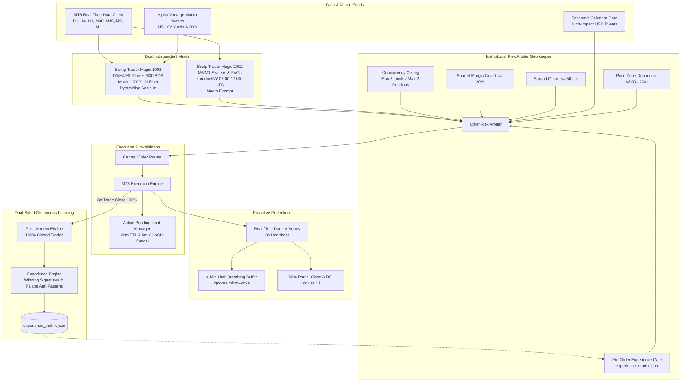

# AUTONOMOUS AGENTIC AI TRADING SYSTEM (XAUUSD) — CURRENT BUILD SPECIFICATION

**Build Version:** `v2.4.0-DualLimit-ContinuousLearning`  
**Active Symbol:** `XAUUSD` (Gold / US Dollar)  
**Execution Platform:** MetaTrader 5 (MT5) Desktop Terminal  
**Language & Runtime:** Python 3.11+ / FastAPI / SQLite / MetaTrader5 API / Google Gemini GenAI SDK  
**Last Updated:** October 2, 2026  

---

## 1. EXECUTIVE SUMMARY & SYSTEM ARCHITECTURE

The system is a fully autonomous, institutional-grade algorithmic trading platform deployed on Gold (**XAUUSD**). It operates using a **Dual-Trader Hierarchy** (two independent strategy minds running in parallel on the same MT5 account equity and margin pool), coupled with **High-Frequency Pending Limit Order Execution**, an **Active 5m CHoCH Invalidation Engine**, a **Real-Time Danger Sentry** with dynamic breathing buffers, and a **Dual-Sided Continuous Learning Engine** powered by Google Gemini and a persistent **Experience Matrix**.



---

## 2. THE DUAL-TRADER HIERARCHY (TWO INDEPENDENT MINDS)

The strategy architecture is split into two completely decoupled agents sharing the same MT5 account equity and margin pool, segregated strictly by MT5 `magic_number`.

### A. Swing Trader ("The Institutional Partner") — Magic: `1001`
- **Timeframe Stack:**
  - Macro Bias: Daily (D1) and 4-Hour (H4) directional flow (200 EMA + 50 EMA trend slope).
  - Context & Key Zones: 1-Hour (H1) structural levels, liquidity pools, and major Order Blocks.
  - Confirmation & Execution: 30-Minute (M30) and 15-Minute (M15) Break of Structure (BOS) / Change of Character (CHoCH).
- **Exogenous Macro Gate (Alpha Vantage):**
  - Evaluates US 10-Year Treasury Yields (`TREASURY_YIELD`) and US Dollar Index (DXY) correlation.
  - **Rule:** Requires falling or neutral 10Y Treasury Yields before permitting Swing Longs; vetoes long setups if yields or DXY are rapidly accelerating upward to prevent fighting institutional macro capital flows.
- **Pullback Scale-In Engine (Pyramiding):**
  - Monitors open Swing positions.
  - When the primary trade reaches $\ge 1:1$ R:R with Stop Loss confirmed at Breakeven, and price pulls back into a 5m/15m FVG or 50%–61.8% equilibrium zone with a confirmed reversal candle, it emits an automated secondary scale-in order at 50% of the primary lot size.
- **Stop Loss & Target:**
  - Structural SL anchored behind the structural swing high/low ($4.00–$8.00 distance on Gold).
  - Target: Institutional 1:3.0 Risk-to-Reward ratio.
- **Base Risk Budget:** 1.5% portfolio equity per swing trade.

### B. Scalp Trader ("The Liquid Sniper") — Magic: `2002`
- **Timeframe Stack:** Operates exclusively on 5-Minute (M5) and 1-Minute (M1) charts.
- **Strategy & Objective:** Rapid trades harvesting short-term volume expansion; session sweeps of previous Asian/London session highs and lows and Fair Value Gap (FVG) mitigations.
- **Session Filter (Volatility Window):**
  - Orders are restricted strictly to the **London & New York volatility windows (07:00–17:00 UTC)**.
  - Completely blocks new entries during low-liquidity Asian ranges to avoid spread drag and chop.
- **Hedging Independence:**
  - Completely exempt from Swing Trader directional bias.
  - Permitted to scalp short-term pullbacks counter to an active Swing position without liquidating each other.
- **Quantitative Loss Freeze:**
  - 2 consecutive scalper losses trigger an automatic 30-minute execution freeze on Magic `2002`.
  - Cumulative daily loss $\ge 2.0\%$ reduces scalper risk to 0.15%.
  - Mandatory 15-minute cooldown after any market exit.
- **Base Risk Budget:** 0.50% portfolio equity per scalp trade.

---

## 3. PENDING LIMIT ORDER ARCHITECTURE (BUY LIMIT & SELL LIMIT)

The execution layer in `backend/app/trading/mt5_engine.py` and `backend/app/execution/order_router.py` has been upgraded to support high-frequency pending limit order execution:

### A. Limit Order Generation & Pricing
- **Bullish Setups:** Place `ORDER_TYPE_BUY_LIMIT` at the **50% equilibrium** or top edge of an M1/M5 Fair Value Gap (FVG) or demand block.
  $$\text{Limit Price} = \frac{\text{Gap Low} + \text{Gap High}}{2.0}$$
- **Bearish Setups:** Place `ORDER_TYPE_SELL_LIMIT` at the **50% equilibrium** or bottom edge of an M1/M5 Fair Value Gap (FVG) or supply block.
  $$\text{Limit Price} = \frac{\text{Gap Low} + \text{Gap High}}{2.0}$$

### B. Order Time-To-Live (TTL) & Invalidation
- **20-Minute TTL Expiration:**
  - Limit orders are dispatched with `type_time = ORDER_TIME_SPECIFIED` and an expiration timestamp 20 minutes in the future (`now + 1200s`).
  - Resilient fallback: If broker rejects `ORDER_TIME_SPECIFIED`, order is sent as `ORDER_TIME_GTC` while software watchdog tracks and cancels it after 20 minutes.
- **5m CHoCH Active Invalidation:**
  - Implemented in `manage_pending_limit_orders(symbol, m5_bars)`:
  - If price forms a Change of Character (CHoCH) on the 5-Minute chart *before* tagging the limit order:
    - **Pending Buy Limit:** Cancelled immediately if an M5 candle closes cleanly below the recent 5m swing low (bearish CHoCH).
    - **Pending Sell Limit:** Cancelled immediately if an M5 candle closes cleanly above the recent 5m swing high (bullish CHoCH).
    - Engine dispatches `ORDER_CANCEL` (`TRADE_ACTION_REMOVE`) to eliminate the stale order.

### C. Concurrency Ceiling & Volume Scaling (Target: 10–25 Trades/Day)
- Removed restrictive daily trade count caps.
- Strict concurrency ceiling enforced:
  - **Maximum 3 Active Limit Orders** (`mt5.orders_get() <= 3`).
  - **Maximum 2 Simultaneous Open Market Positions** (`mt5.positions_get() <= 2`).

---

## 4. DUAL-SIDED CONTINUOUS LEARNING ENGINE & EXPERIENCE MATRIX

Located in `backend/app/agent/experience_engine.py` and `backend/app/agent/post_mortem.py`:

### A. 100% Closed Trade Reflection
Every closed trade on MT5 (Win, Loss, or Breakeven) triggers Google Gemini post-mortem reflection:
- **On WIN:** Gemini analyzes primary contributing factors:
  > *"Analyze why this XAUUSD trade won. Identify the primary contributing factor: limit placement accuracy, session volume, higher-timeframe confluence, or risk-to-reward ratio. Formulate a 'Winning Setup Signature'."*
- **On LOSS:** Gemini analyzes failure causes:
  > *"Analyze why this XAUUSD trade failed. Identify whether it was front-running a sweep, counter-trend friction, or news volatility. Formulate a 'Failure Anti-Pattern'."*

### B. Persistent Experience Matrix (`backend/data/experience_matrix.json`)
The matrix clusters trades into dynamic setups:
- `M5_FVG_LIMIT`: Intraday limit entries at M5 Fair Value Gap equilibrium.
- `M1_SWEEP_RETEST`: Session high/low liquidity sweep retest limit entries.
- `H1_PULLBACK_LIMIT`: Higher-timeframe swing pullback and scale-in limits.
- `SWING_M30_BOS_LIMIT`: Institutional swing trend continuation entries.

For each cluster, the engine maintains:
$$\text{Confidence Score} = \frac{\text{Successful Trades}}{\text{Total Attempts}}$$

Scores, winning signatures, and failure anti-patterns are automatically updated upon every trade exit.

---

## 5. PRE-ORDER EXPERIENCE VALIDATION GATE

Implemented in `backend/app/agents/arbiter.py` and `backend/app/trading/arbiter.py`:

Before any Buy Limit or Sell Limit order is submitted to MT5:
1. **Cluster Lookup:** Retrieves setup metrics from `experience_matrix.json`.
2. **Journal Verification:** Queries the last 2 winning and last 2 losing trade journals for that setup.
3. **Low Confidence Gate ($< 60\%$):** If the historical confidence score is $< 60\%$, the order **requires higher-timeframe (H1) directional confirmation**. If the H1 trend contradicts or is neutral, the proposal is rejected with `REJECTED_EXPERIENCE_GATE`.
4. **High Confidence Fast-Track ($\ge 75\%$):** If confidence is $\ge 75\%$, the order is approved immediately with **dynamic lot sizing** (+15% risk scaling).

---

## 6. PROACTIVE DANGER SENTRY & BUFFER FOR LIMIT ENTRIES

Located in `backend/app/trading/danger_sentry.py`:

### A. 4-Minute Limit Breathing Buffer (240 Seconds)
- When a limit order fills, `_is_limit_fill()` activates a **4-minute buffer period (240s)** where micro-exhaustion wicks are ignored.
- The trade is given room to breathe without premature exits.
- Only two conditions trigger early exit during the buffer:
  1. Price cleanly closes beyond the 5m structural invalidation anchor.
  2. Price reaches the 85% Stop Loss danger boundary.

### B. 180-Second Grace Period for Market Entries
- Standard market entries receive 180 seconds where micro-structural noise is bypassed.

### C. Buffered 5-Minute Exhaustion Exit
- Evaluated on M5 (not noisy 1m).
- Requires at least **2 consecutive 5m rejection candles with wicks $\ge 50\%$ of range and declining volume** before triggering an exit.

### D. Clean 5-Minute Structural Invalidation
- Only closes if an M5 candle cleanly closes against the trade relative to 5m swing high/low pivots.

### E. 50% Partial Take-Profit & Breakeven Lock at 1:1 R:R
- When price reaches $1:1$ Risk-to-Reward, automatically closes 50% of position volume and moves Stop Loss to Entry $\pm \$0.20$ spread buffer.

### F. Real-Time Guard Heartbeat
- Runs every **3 seconds** continuously to monitor spread blowouts (> 50 points / $0.50), danger territory, and take-profit milestones.

---

## 7. INSTITUTIONAL RISK CONTROLS & MARKET FILTERS

### A. Account Capital Tiers (`capital_manager.py`)
| Tier | Account Equity Range | Max Risk per Trade | Max Concurrent Positions |
|---|---|---|---|
| **Tier 1** | $< \$250$ | 1.5% | 1 position |
| **Tier 2** | $\$250 - \$500$ | 2.0% | 2 positions |
| **Tier 3** | $> \$500$ | 2.0% | Concurrency ceiling: 3 Limits / 2 Positions |

- **Micro-Account Trap Guard:** Mathematically verifies that the structural stop distance does not force lot size below broker minimum ($0.01$ lots).
- **10% Daily Drawdown Circuit Breaker:** Halts new trade proposals if equity drops $10.0\%$ in a 24-hour cycle.

### B. Shared Margin Guard (`mt5_engine.py`)
- Verifies cumulative utilized margin across **both magic numbers (1001 & 2002)**.
- If cumulative margin utilization exceeds **20.0% of equity**, all new proposals are blocked.

### C. Setup Invalidation Price Zone Debounce (`cooldown_manager.py`)
- When any trade closes at a loss or emergency exit, that specific **$\$3.00$ price zone** is blacklisted for **20 minutes** for that direction.
- Prevents revenge trading and stop-run churn.

### D. Macro News Blackout Gate (`market_filters.py`)
- Tracks high-impact USD economic calendar events (FOMC, NFP, CPI, Fed Speeches).
- **Blackout Window:** Automatically halts trading from **30 minutes prior** to **15 minutes post-release**.

---

## 8. FILE STRUCTURE & KEY COMPONENT LOCATIONS

```
autonomous-trading-ai/
├── CURRENT_BUILD.md                     <-- This comprehensive build document
├── backend/
│   ├── app/
│   │   ├── agent/
│   │   │   ├── experience_engine.py    <-- Experience Matrix & setup cluster confidence
│   │   │   ├── post_mortem.py          <-- Dual-sided AI trade analysis (Wins & Losses)
│   │   │   └── core.py                 <-- Agent orchestration base
│   │   ├── agents/
│   │   │   ├── arbiter.py              <-- Chief Risk Arbiter with Experience Gate & Concurrency
│   │   │   ├── macro_director.py       <-- Higher-timeframe regime & D1/H4 market structure
│   │   │   ├── scalp_trader.py         <-- Magic 2002: M5/M1 London/NY FVG & sweep limit proposals
│   │   │   ├── swing_trader.py         <-- Magic 1001: H4/H1/M30 flow, 10Y yield gate, pyramiding
│   │   │   └── trade_proposal.py       <-- Standardized TradeProposal schema with limit attributes
│   │   ├── config/
│   │   │   └── settings.py             <-- System credentials, MT5 modes, risk parameters
│   │   ├── data/
│   │   │   ├── alpha_vantage.py        <-- Exogenous macro yield & economic indicators
│   │   │   └── mt5_data.py             <-- MT5 real-time tick & multi-timeframe bar fetching
│   │   ├── execution/
│   │   │   ├── base.py                 <-- Base execution router
│   │   │   ├── order_router.py         <-- Central router with limit order execution & slicing
│   │   │   └── smart_execution.py      <-- Slippage caps, spread filters, and lot slicing
│   │   ├── indicators/
│   │   │   └── smc.py                  <-- SMC Analyzer: FVGs, Order Blocks, BOS/CHoCH, Sessions
│   │   ├── models/
│   │   │   ├── strategy.py             <-- TradingHypothesis ORM model
│   │   │   └── trading.py              <-- Order, Position, TradeJournal, AccountBalance models
│   │   ├── risk/
│   │   │   ├── capital_manager.py      <-- Account tiers, exact lot sizing, circuit breakers
│   │   │   └── market_filters.py       <-- Spread guard & macro news calendar blackout
│   │   ├── trading/
│   │   │   ├── arbiter.py              <-- Trading module alias for ChiefRiskArbiter
│   │   │   ├── cooldown_manager.py     <-- Price zone debounce ($3.00 / 20m) & scalper cooldown
│   │   │   ├── danger_sentry.py        <-- 3s sentry, 4m limit buffer, 5m exhaustion & invalidation
│   │   │   ├── macro_worker.py         <-- 30-minute cached US 10Y yield worker
│   │   │   ├── mt5_engine.py           <-- MT5 connector, limit orders, 20m TTL & 5m CHoCH cancels
│   │   │   └── paper_engine.py         <-- Local simulated execution fallback
│   ├── data/
│   │   └── experience_matrix.json      <-- Persistent setup clusters, win rates & signatures
│   ├── scripts/
│   │   ├── run_bot.py                  <-- Main Dual-Trader Orchestrator daemon
│   │   └── run_dashboard.py            <-- FastAPI live monitoring dashboard server
│   └── trading.db                      <-- SQLite local database (journals, hypotheses, positions)
```

---

## 9. ACTIVE RUNTIME DAEMONS & PORTS

| Daemon Script | Port / Target | Frequency | Purpose |
|---|---|---|---|
| `run_bot.py` | MT5 Terminal | 3s heartbeat / 1m cycle / 15m macro | Dual-Trader orchestration, Danger Sentry, Limit Manager |
| `run_dashboard.py` | `http://localhost:8000` | Real-time HTTP/REST | Interactive web dashboard, audit logs, journal review |

### How to Run / Restart:
```bash
# Set Python path
$env:PYTHONPATH="backend"

# Start Live Bot Orchestrator
.\backend\venv\Scripts\python.exe .\backend\scripts\run_bot.py

# Start Web Dashboard
.\backend\venv\Scripts\python.exe .\backend\scripts\run_dashboard.py
```
