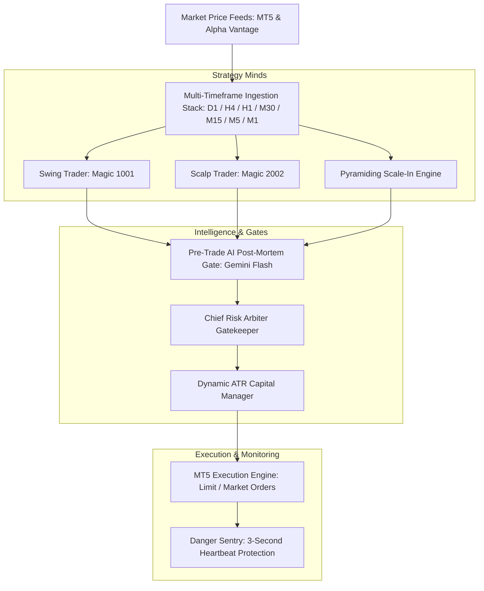
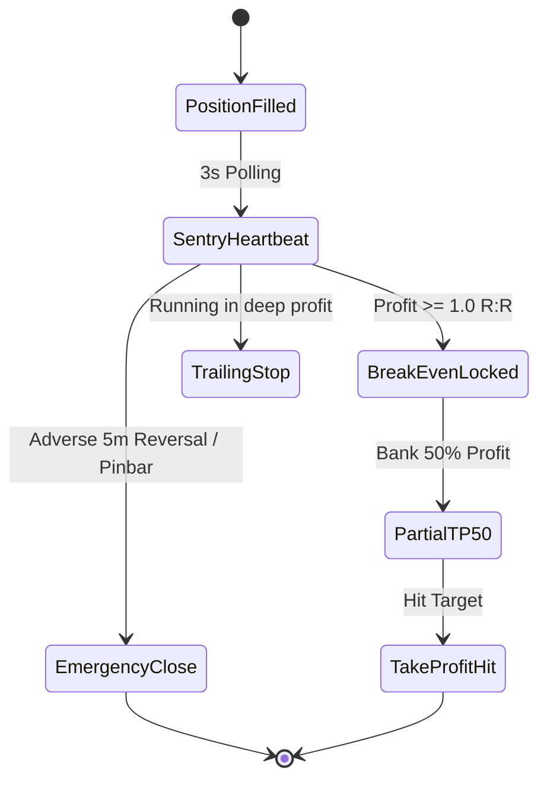

# Comprehensive Institutional Entry & Execution Methodology
**Autonomous Trading AI Engine for XAUUSD (Gold)**

This document details the multi-layered algorithmic and quantitative architecture used by the Autonomous Trading AI to scan, validate, gate, size, and execute trades on MT5.

---

## 🏗️ System Architecture Overview

The system operates as a **Dual-Trader Multi-Mind Architecture** coordinated by a strict **Chief Risk Arbiter**:

---

## 1. 🦅 Swing Trader Methodology (`Magic: 1001`)

The Swing Trader operates across **D1 / H4 / H1 / M30 / M15** to capture macro structural expansions.

### A. Macro & Yield Gate (Alpha Vantage)
Before generating any swing hypothesis, the Macro Worker inspects the macro landscape:
1. **US 10-Year Treasury Yields (`TREASURY_YIELD`):**
   - Yields dropping / stable $\rightarrow$ **Bullish Gold Bias** (Approved).
   - Yields surging rapidly $\rightarrow$ **Bearish Gold Friction** (Longs Vetoed).
2. **US Dollar Index (`DXY` / `FX_DAILY`):**
   - Weak/Bearish USD $\rightarrow$ Enhances Gold Long setups.
   - Strong/Bullish USD $\rightarrow$ Enhances Gold Short setups.

### B. Structural Market Confirmation (Smart Money Concepts)
1. **Trend Identification (H4 / H1):**
   - Identifies higher highs / higher lows (**Bullish**) or lower highs / lower lows (**Bearish**).
   - Confirms Break of Structure (**BOS**) or Change of Character (**CHoCH**).
2. **Equilibrium Retracement:**
   - Uses the dealing range from the swing high to the swing low.
   - **Long Entry:** Must retrace into the **50% Discount Zone** or an unmitigated **Bullish Fair Value Gap (FVG) / Order Block**.
   - **Short Entry:** Must retrace into the **50% Premium Zone** or an unmitigated **Bearish FVG / Order Block**.
3. **Execution Mode:**
   - Employs **Passive Limit Orders** (`BUY_LIMIT` / `SELL_LIMIT`) placed at the 50% equilibrium level.
   - Pending limits have a **20-minute Time-To-Live (TTL)** and auto-cancel if 5m structural invalidation occurs.

---

## 2. ⚡ Scalp Trader Methodology (`Magic: 2002`)

The Scalp Trader operates on **M5 / M1** to capture rapid intraday liquidity sweeps and micro Fair Value Gaps.

### A. Session Volatility Window Filter
- **Active Window:** **07:00 UTC to 17:00 UTC** (London & New York Session overlap).
- **Off-Hours Range:** All scalp entries are strictly blocked during low-liquidity Asian / late night hours to avoid spread widening and chop.

### B. Setup 1: Session Liquidity Sweep Retest
1. **Asian / London High/Low Sweep:**
   - Detects when price wicks beyond previous session high/low to grab stop liquidity.
   - Must form an immediate **rejection wick** on the M1/M5 chart.
2. **Entry & Targets:**
   - **Entry:** Limit order at the **50% equilibrium of the sweep wick**.
   - **Stop Loss:** 50 points ($0.50) beyond the extreme wick tip.
   - **Take Profit:** Target **1:1.8 to 1:2.0 R:R**.

### C. Setup 2: M5 Fair Value Gap (FVG) Retracement
1. **Displacement:** Identifies 3-candle imbalance gaps (FVG) formed during high session volume.
2. **Entry:** Limit order placed at the exact 50% midpoint of the FVG.
3. **Stop Loss:** Placed beyond the candle 1 origin of the gap.

### D. Mandatory Post-Exit Cooldown
- Whenever a scalper trade exits (Take-Profit, Stop-Loss, or Sentry exit), a **15-minute mandatory cooldown** is enforced to eliminate revenge trading.

---

## 3. 🧠 Pre-Trade AI Reflection & Anti-Pattern Gate

Every candidate setup generated by either strategy mind must pass an AI reflection check before reaching the Arbiter:

1. **Failure Anti-Pattern Query:**
   - The engine retrieves the **last 3 failed trades** for that specific magic number from SQLite (`TradeJournal`).
2. **Gemini Pre-Trade Audit:**
   - Passes the proposed trade parameters (Price, Direction, SL, TP, Thesis) alongside the past failures to `gemini-3.5-flash`.
3. **Rejection Conditions:**
   - Rejects if the trade repeats an anti-pattern (e.g., shorting into strong session momentum without rejection wicks).
   - Rejects if the proposed entry is within **$3.00** of a recent adverse stop-out level within the last 20 minutes (**Price Zone Debounce**).

---

## 4. 🛡️ Chief Risk Arbiter Gatekeeper

The Arbiter serves as the final barrier before routing orders to MT5:

| Gate | Check | Threshold / Rule |
| :--- | :--- | :--- |
| **Circuit Breaker** | Portfolio Drawdown | Max **5% overall** or **2% daily** drawdown stops all trading. |
| **Shared Margin Guard** | Account Margin Utilization | Total margin across all positions cannot exceed **20%**. |
| **Spread Guard** | Real-Time Broker Spread | Blocks orders if Gold spread exceeds **50 points ($0.50)**. |
| **News Blackout** | USD High-Impact Calendar | Freezes new entries **30m before** and **15m after** CPI, NFP, FOMC. |
| **Zone Debounce** | Repeated Stopout Protection | Blacklists entries within **$3.00** of recent loss for 20 minutes. |
| **Experience Matrix** | Pattern Historical Confidence | Requires $\ge 60\%$ historical win-rate or demands H1 trend confirmation. |

---

## 5. 💰 Dynamic Lot Sizing Formula

Lot sizing is calculated dynamically on every trade based on real-time equity, risk tier, and structural ATR stop-loss distance:

$$\text{Risk Amount (\$) } = \text{Account Equity} \times \text{Risk \%}$$

$$\text{Sized Lots} = \frac{\text{Risk Amount (\$) }}{|\text{Entry Price} - \text{Stop Loss Price}| \times \text{Tick Value}}$$

- **Swing Trader Risk:** `1.5% - 2.0%` of equity.
- **Scalp Trader Risk:** `0.5% - 1.0%` of equity.
- **Tick Value on Gold (XAUUSD):** `$1.00` per 0.01 point per standard lot.

---

## 6. 🚨 Danger Sentry (Active Position Management)

Once a position is filled on MT5, the **Danger Sentry** executes continuous monitoring on a **3-second heartbeat**:

1. **Break-Even Lock (BE):**
   - When floating profit reaches $\ge 1.0 \text{ R:R}$, the Sentry automatically modifies MT5 stop loss to entry price $+ \$0.20$ buffer.
2. **Partial Take-Profit (50%):**
   - Automatically closes 50% of the volume at $1.0\text{ R:R}$ to guarantee realized profit.
3. **Proactive Exhaustion Exit:**
   - Detects violent counter-impulse wicks on 1m/5m and closes positions early before SL is hit.
4. **Pyramiding Scale-In Engine:**
   - If an existing Swing position is running in profit ($\ge 1.0\text{ R:R}$) with BE locked, and price pulls back to retest an FVG, it opens a half-sized scale-in position.

---

## 7. 📊 Summary Table of Entry Rules

| Parameter | Swing Trader (`1001`) | Scalp Trader (`2002`) |
| :--- | :--- | :--- |
| **Timeframes** | D1 / H4 / H1 / M30 / M15 | M5 / M1 |
| **Time Window** | 24/5 Active (Gated by Macro Yields) | London & NY Only (07:00 - 17:00 UTC) |
| **Entry Trigger** | 50% Equilibrium BOS / FVG Retest | Session High/Low Liquidity Sweep + Rejection |
| **Order Type** | Passive Limit Orders (20m TTL) | Passive Limit / Micro Retest Limits |
| **Risk:Reward** | 1:2.5 to 1:3.0+ | 1:1.8 to 1:2.0 |
| **Risk % per Trade**| 1.5% | 0.5% |
| **Cooldown** | Price Zone Debounce ($3.00) | Mandatory 15m Post-Exit Cooldown |
